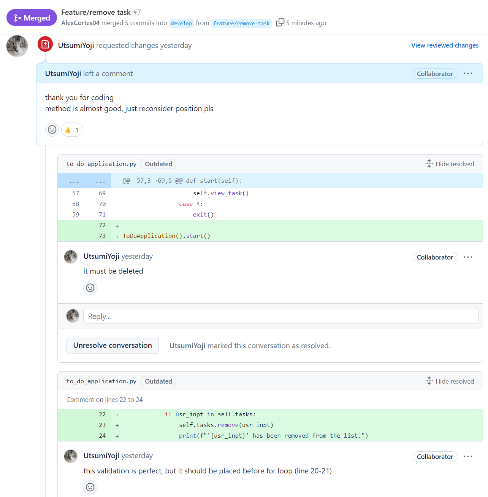
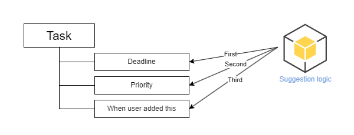
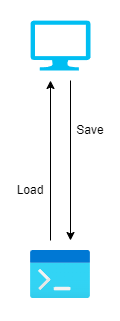

<!-- _class: center -->

# Mini-Project1
**To-do-application**

June 13th, 2024
Alex, Yoji

--- 

# Agenda

1. Overreview
2. How did we use GitHub
3. Conding
   1. Part1
   2. Part2
   3. Additional
4. Demonstration
5. Conclusion
   1. Yoji
   2. Alex

---

# Overreview

## Objective

Create simple to-do-console-application.

## Features

User can add, view, remove tasks.
And also, application suggest task depend on priority and deadline.

---

# How did we use GitHub

## We used "GitFlow"

- It is good way to review, test codes

## Branches which we made

- main
- develop
- slide
- feature/*

---

# Coding - part1

## We made validation for start, add, view, delete

start task
- User input is number which is not negative and float
- User input is from 1 to 4.
  
add task
- User input something (don't accept empty input)

---

<!-- _class: top -->

view tasks
- There is any task (there is no task, it will show warning)

delete task
- User input something (don't accept empty input)
- There is any task (there is no task, it will show warning)
- Tasks include user input (don't accept task which is not exists)

---

# Coding - part2 (Create suggestion) 

## Edit add, view, remove task function

We had to store extra input, deadline and priority, so we edited functions.

**Addtional validation**
- For priority, we only accept "high", "medium", "low". if user input something else, it shows error.
- For deadline, we only accept "YYYY-MM-DD" formated date. if user input something else, it shows error.

**Warning**
- For deadline, if user input past date or today, it shows warning.

---

<!-- _class: top -->

## Suggestion logic

- Show task which alredy passed deadline or close to deadline date.
- If there are two or more tasks like that, compare priority. Application would show task which has higher priority.
- if there are two or more task which has same deadline and same priority, application would show task which was added ealier

---

# Coding - additional

## Data-Save function

### Problem

If you close or exit application, your tasks are gone.
It means when you close and reopen application, there are no task which you have added.

### Solution

When you close or exit application, application save tasks in computer harddesk. When you open application, application load data from harddesk

---

# Demonstration

---

## You can see our code here!
https://github.com/AlexCortes04/Mini_project1

---

# Conclusion

**What was the challenges and impressions**

## Yoji

I used to use "GitLab" which is similier to "GitHub", so I was easy to get used to. But it was glad to learn about GitHub. I used "Marp" to make Slides. It was first time to use, but it was very usefull and easy to use.

## Alex
